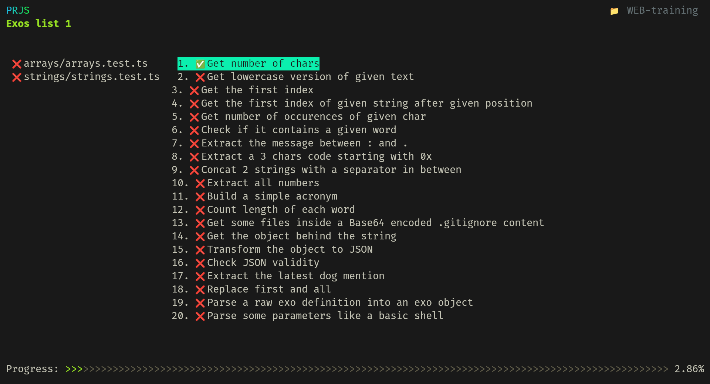
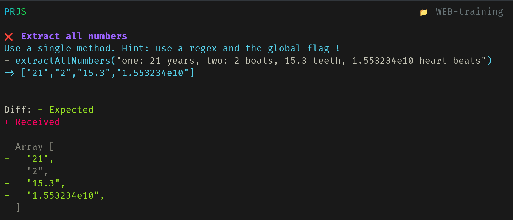
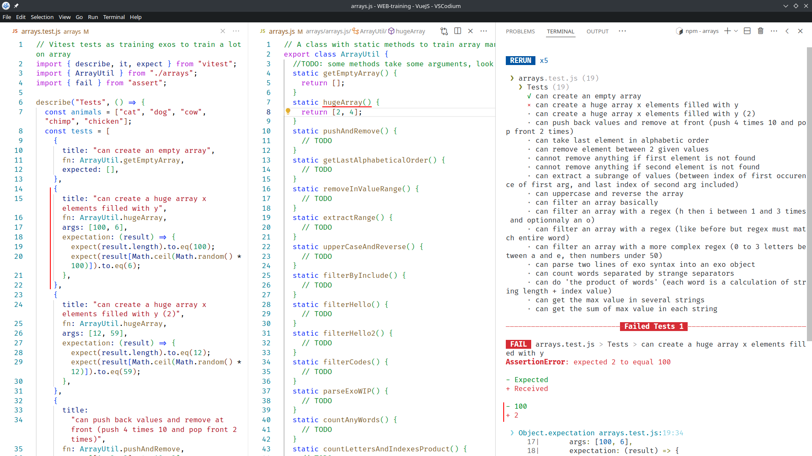
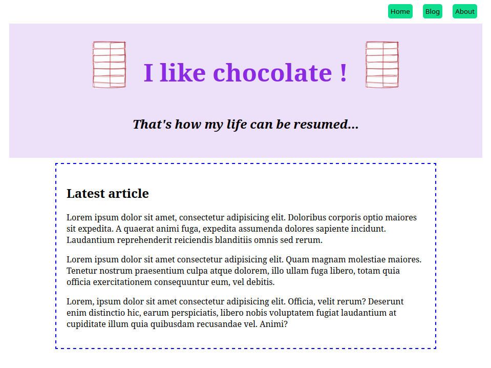

# WEB-training
**Small exos for the HEIG-VD WEB course to train some HTML, CSS and mostly JavaScript. Exos in JavaScript are designed to be ran with [PRJS](https://github.com/samuelroland/prjs) !**

My solutions can be found in the `solution` branch as separated file named `solution.js` or `solution.html`.

<!-- todo: how to make PRJS work without this step ? -->

## Available exos
Here is the current list of available exos, each exos suite is stored in its dedicated folder:
- `arrays`: ~15 arrays manipulation exos
- `strings`: ~20 strings manipulation exos
- `styling`: a small web page to design in pure CSS

### JS exos

Install dependencies (this includes PRJS and Vitest, this needs to be done just once) and run prjs
```sh
npm install
npx prjs
```

Running `npx prjs` will start PRJS in full screen, you can start practicing! Type `l` to see skills and exos lists, select the appropriate skill with `j` and `k`, go right with `l`, use `j` or `k` again to select an exo, and finally type `enter` to enter the details of an exo. You will see the starting error, you can start your editor in the repos folder, open the single JS file present for this skill in the right folder, if you start coding and hit Ctrl+S, it will refresh the view. When you are done, you can go the next exo with `n` or go back to the previous with `p`.

**Note for WSL2 users**: do not clone the repository under the Windows filesystem (anything under `/mnt/`) because "file changed events" are not transfered from Windows filesystem to WSL2, the watch mode will not work in this case. Make sure this repository in under the Linux filesystem (under `/home/<user>`) so events can be listened by PRJS and it can run tests again and refresh the UI.




<details>
<summary>In case it doesn't work</summary>
Check the PRJS repository README for some known issues !

If it really doesn't work, you can still run the exos with Vitest directly, but the experience will be reduced...

```sh
npx vitest --bail 1
```
The `--bail 1` make the runner stop at first fail so you can see output of failed test one after the other. Vitest run tests in watch mode by default so open your terminal along your IDE so you can see both !



</details>

### Remoji
Training of React and doing fetch requests.


See more in [remoji/remoji.md](remoji/remoji.md)

A basic working but imperfect solution is available in the `solution` branch too. By the way, you can quickly see the diff with `git diff  main..solution remoji`.

### Styling
Folder: `styling`  
The goal is to train designing a small web page in pure CSS to train a few concepts like colors, border, backgrounds, margins, padding, placement, basic tags, css selection, ...

<details>
<summary>See more</summary>

Install the Live Server extension in VSCode, open `styling/index.html`, open the live preview and start designing this page:



- TODO: make the page train flexbox and grid
- TODO: make other smaller exos to train CSS styling like a form

</details>
