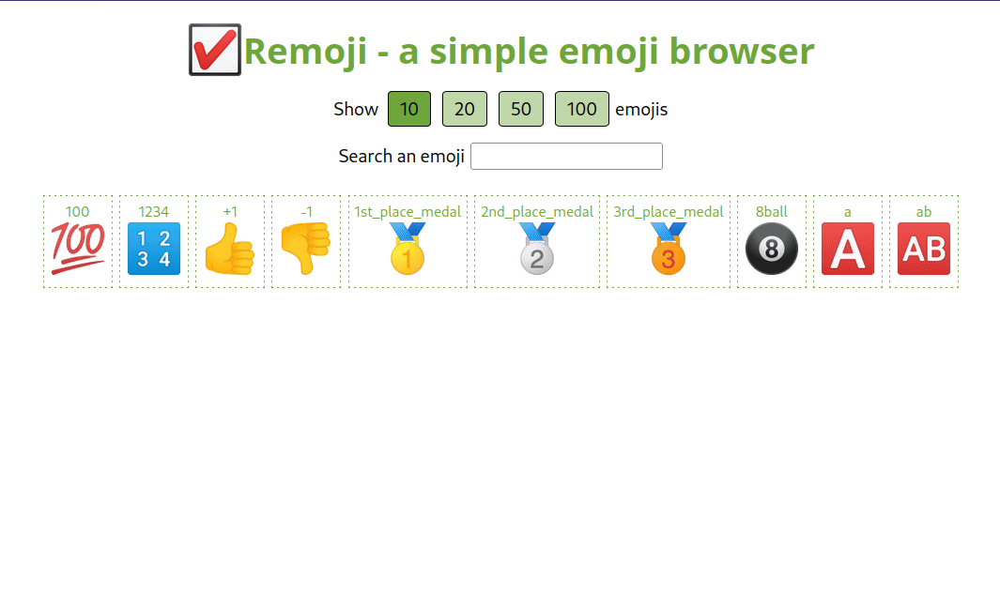
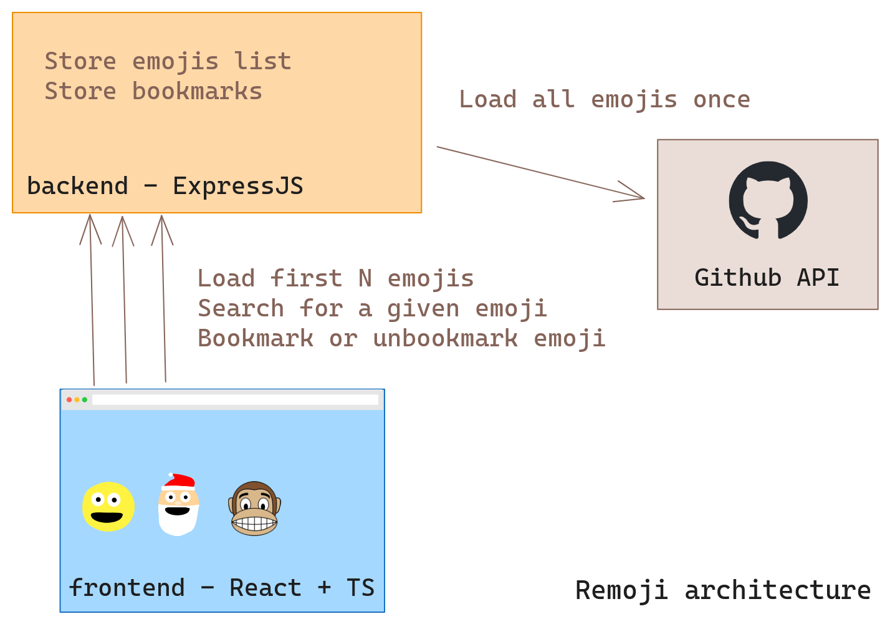

# Remoji - a simple emoji browser

Emoji are fun but they are sometimes hard to find or compare. Let's make a simple emoji browser to easily list, search, copy and bookmark emojis !




## Goal
1. Train writing basic React components but with help on where to write what
1. Train fetch requests
1. Train reading an ExpressJS backend just to understand the available routes

## Context
We have:
1. The frontend: a React SPA (Single Page Application) developed in TypeScript. Runs on `localhost:3000`.
1. The backend: an ExpressJS server in TypeScript too. Runs on `localhost:8080`.
1. The GitHub API as a source for the emojis (on `api.github.com`).

*To limit the amount of unecessary requests to the GitHub API (it is rate limited obviously), we will load them all once in the backend when the client ask for it. If the client ask them again, we used the cached version, we don't do load them from GitHub again.*

**Architecture**



**Files tree view**
```
.
├── backend
│  ├── package-lock.json
│  ├── package.json
│  └── server.js
├── frontend
│  ├── package-lock.json
│  ├── package.json
│  ├── public
│  │  ├── favicon.ico
│  │  ├── index.html
│  │  └── robots.txt
│  ├── README.md
│  ├── src
│  │  ├── App.tsx
│  │  ├── components
│  │  │  ├── EmojiBlock.tsx
│  │  │  ├── EmojiImage.tsx
│  │  │  ├── EmojiList.tsx
│  │  │  └── Search.tsx
│  │  ├── index.css
│  │  ├── index.tsx
│  │  └── types.ts
│  └── tsconfig.json
└── remoji.md
```

<!-- TODO: tree output after bookmark update -->

## Instruction

**Note: bookmarks are not implemented in solution for now...**

Here the basic data structure in `types.ts`.
```typescript
export type Emoji = {
    name: string;
    link: string;
};
```

Implement the following features:
1. Complete all TODOs in components in `src/components` before touching to App
1. When the page loads, the first N it should show the first N emojis and let the user change N (10, 20, 50, 100) with simple buttons. By default, it should be 10.
1. Implement the search system by updated the precedent logic
1. Show bookmarked emojis (NO SOLUTION)
1. Bookmark or unbookmark an emoji (NO SOLUTION)
